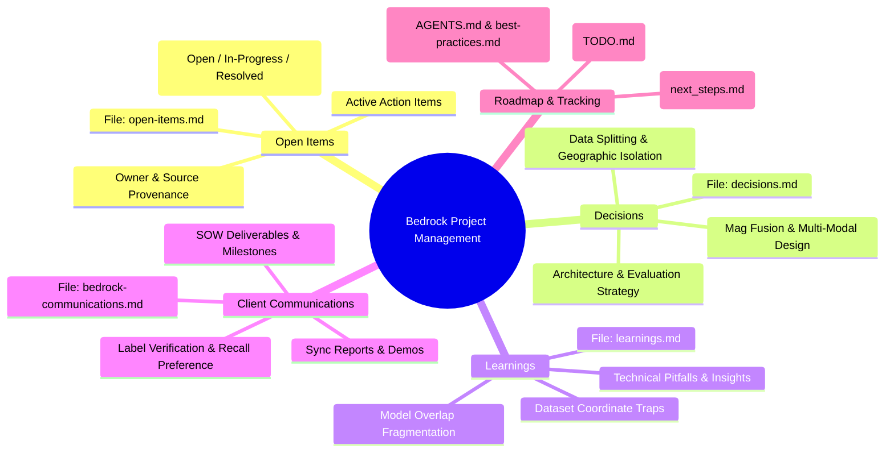

# Project Management Mind Map

**Summary**: Visual mind map and index of the Bedrock x Crescer AI project management components, tracking files, and workflow relationships.

**Last updated**: 2026-07-28

---

## Mind Map

---

## Component Breakdown

| Component File | Primary Function | What It Tracks |
| :--- | :--- | :--- |
| `open-items.md` | Action Items & Blockers | Unresolved tasks, data requests, owners, and progress status (`Open`, `In-Progress`, `Resolved`). |
| `decisions.md` | Governance & Strategy | Explicit engineering and product decisions, dated with full rationale. |
| `learnings.md` | Knowledge Retention | Non-obvious pitfalls, dataset quirks (e.g., S7K depth Z-axis orientation), and post-mortem findings. |
| `bedrock-communications.md` | Client Alignment | Sent reports, client requests/feedback, meeting notes, and SOW milestone acceptance records. |
| `next_steps.md` | Sprint Roadmap | Active domain-by-domain engineering priorities derived from recent syncs. |
| `TODO.md` | Technical Backlog | Known open issues, root causes, and long-term resolution plans for the engineering team. |

---

**Sources**: project_management/open-items.md; project_management/decisions.md; project_management/learnings.md; project_management/bedrock-communications.md
